## Before optimization

### Sorting

- **Commit Duration:** 1.6s
- **Render Duration:** 142ms
- **Interactions:** Sorting

### Screenshots

**Flame Graph:**  
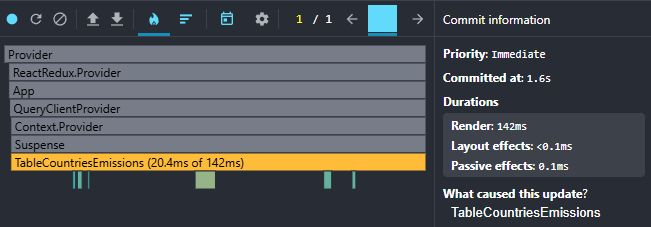  
**Ranked Chart:**  
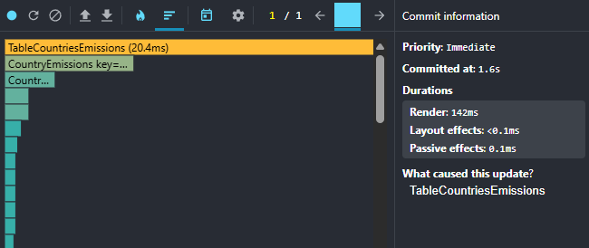

### Searching a country

- **Commit Duration:** 1.5s
- **Render Duration:** 3.8ms
- **Interactions:** Searching a country

### Screenshots

**Flame Graph:**  
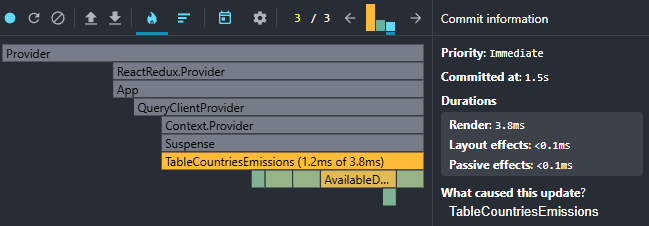  
**Ranked Chart:**  
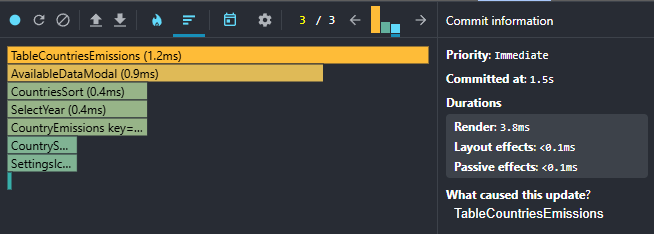

### Selecting a year

- **Commit Duration:** 2.1s
- **Render Duration:** 128.1ms
- **Interactions:** Selecting a year

### Screenshots

**Flame Graph:**  
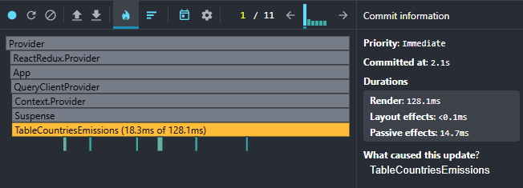  
**Ranked Chart:**  
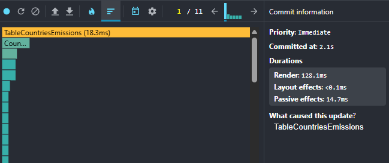

### Adding/removing columns

- **Commit Duration:** 3.8s
- **Render Duration:** 152.3ms
- **Interactions:** Adding/removing columns

### Screenshots

**Flame Graph:**  
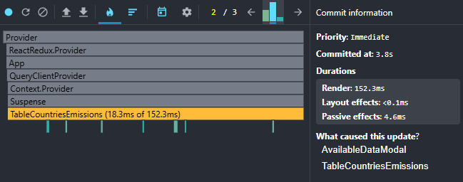  
**Ranked Chart:**  
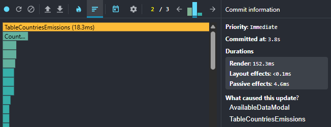

## After optimization

### Sorting

- **Commit Duration:** 1.2s
- **Render Duration:** 19.1ms
- **Interactions:** Sorting

### Screenshots

**Flame Graph:**  
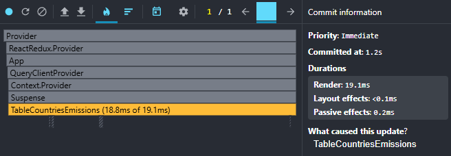  
**Ranked Chart:**  
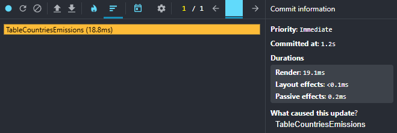

### Searching a country

- **Commit Duration:** 1.7s
- **Render Duration:** 3.1ms
- **Interactions:** Searching a country

### Screenshots

**Flame Graph:**  
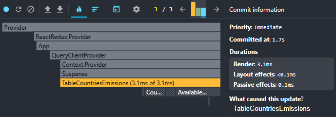  
**Ranked Chart:**  
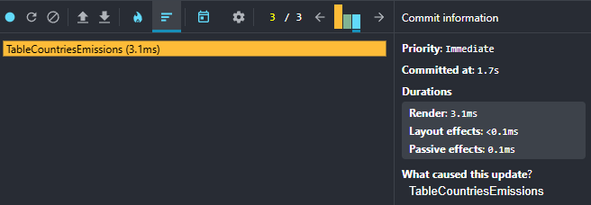

### Selecting a year

- **Commit Duration:** 1.1s
- **Render Duration:** 158.5ms
- **Interactions:** Selecting a year

### Screenshots

**Flame Graph:**  
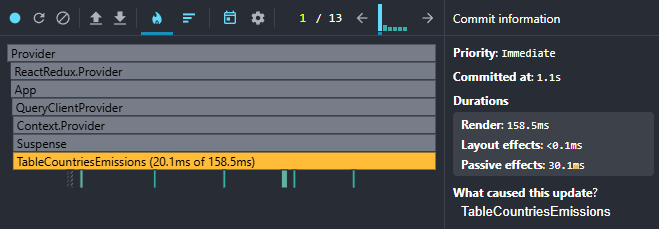  
**Ranked Chart:**  
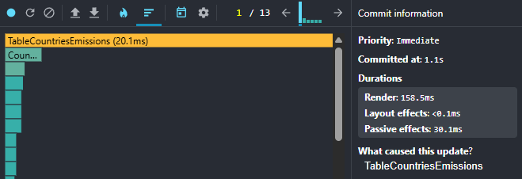

### Adding/removing columns

- **Commit Duration:** 1.4s
- **Render Duration:** 191.6ms
- **Interactions:** Adding/removing columns

### Screenshots

**Flame Graph:**  
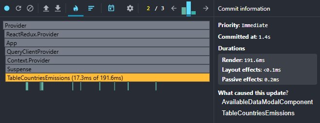  
**Ranked Chart:**  
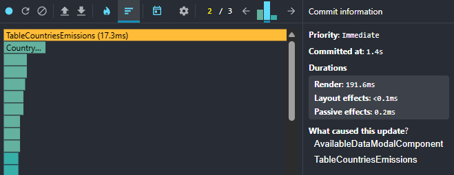
